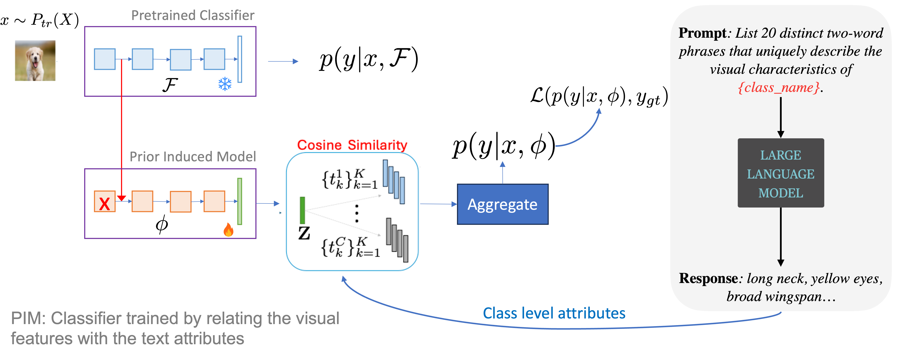

# DECIDER

[](https://arxiv.org/pdf/2408.00331) [](https://link-to-website) 

<!-- [](https://link-to-video) -->

## Abstract

In this work, we introduce DECIDER (Debiasing Classifiers to Identify Errors Reliably), a novel method for detecting failures in image classification models. DECIDER uses large language models (LLMs) to identify key task-relevant attributes and vision-language models (VLMs) to align visual features to these attributes, creating a "debiased" version of the classifier. Potential failures are detected by measuring the disagreement between the original and debiased models. DECIDER not only identifies likely failures but also provides interpretable explanations through an attribute-ablation strategy. Across various benchmarks, DECIDER outperforms existing methods in failure detection.

## Architecture

<!-- Add the architecture.png to be displayed -->


## Folder Setup

```bash
├── data/                  # Folder containing datasets
├── logs/                  # Folder where logs and results are saved
├── models/                # Folder to store model files
├── scripts/               # Folder containing bash scripts
├── train_classifier.py    # Script to train the classifier
├── train_failure_evaluator.py    # Script to train the failure evaluator
├── failure_eval.py        # Script to run failure evaluation
```

## Requirements

The project dependencies can be installed using the following command:

```bash
pip install -r requirements.txt
```

## Instructions to Run

### 1. Train the Image Classifier

The `train_classifier.py` script trains the classifier. You can customize the dataset, model, and hyperparameters using the following command:

```bash
python train_classifier.py --dataset_name <DATASET_NAME> --data_path <DATA_PATH> [other optional arguments]
```

#### Example Command:

```bash
python train_classifier.py \
    --dataset_name "cifar10" \
    --data_path "./data" \
    --image_size 224 \
    --batch_size 64 \
    --num_epochs 50 \
    --classifier_model "resnet18" \
    --use_pretrained
```

### 2. Train the Failure Evaluator

After training the classifier, you can train the failure evaluator using the `train_failure_evaluator.py` script.

```bash
python train_failure_evaluator.py --dataset_name <DATASET_NAME> --data_dir <DATA_PATH> --classifier_name <CLASSIFIER_NAME> [other optional arguments]
```

#### Example Command:

```bash
python train_failure_evaluator.py \
    --dataset_name "cifar100" \
    --data_dir "./data" \
    --classifier_name "resnet50" \
    --num_epochs 100 \
    --learning_rate 1e-3 \
    --scheduler "cosine" \
    --save_dir "./logs"
```

### 3. Run Failure Evaluation

After training both the classifier and the failure evaluator, you can evaluate failures using the `failure_eval.py` script.

```bash
python failure_eval.py --dataset_name <DATASET_NAME> --data_dir <DATA_PATH> --method <METHOD> [other optional arguments]
```

#### Example Command:

```bash
python failure_eval.py \
    --dataset_name "cifar100" \
    --data_dir "./data" \
    --method "PIM" \
    --score "msp" \
    --eval_dataset "cifar100" \
    --filename "cifar100c.log" \
    --cifar100c_corruption "gaussian_blur" \
    --severity 5
```

## Notes

- Modify the bash scripts as needed for your specific environment and dataset paths.
- The `data_path` argument should point to the directory where your datasets are stored.
- Logs and results will be saved in the `logs/` folder unless a different directory is specified.
